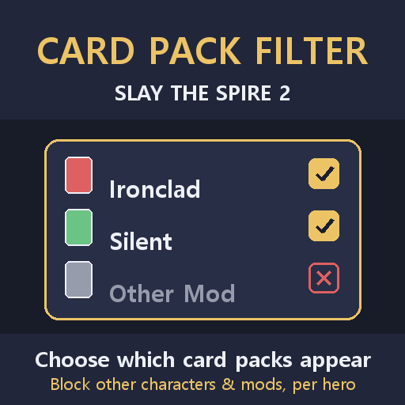

# StS2 Card / Relic Pack Filter (카드/유물 팩 필터)

Slay the Spire 2 런에 **등장할 카드팩과 유물을 캐릭터별로 제어**합니다. 다른 캐릭터의 카드나 다른
모드의 카드·유물이 보상·상점·이벤트·보물방·전투 중 생성에 섞여 나오는 것을 막습니다.

## 왜

캐릭터 모드·콘텐츠 모드를 깔면 외부 카드·유물이 제공 목록에 섞일 수 있습니다. 이 모드로 각 캐릭터마다
어떤 카드팩과 어떤 모드의 유물을 허용할지 정확히 고를 수 있습니다. 캐릭터 선택 화면의 두 탭
(**카드** / **유물**) 패널로 조작합니다.

## 유물 & 고대의 존재 (v0.4.0)

**유물** 탭에서 모드를 차단하면 그 모드의 유물이 모든 출처(보상·상점·보물방)에서 제거됩니다. 직접
지급되는 유물(고대의 존재 이벤트 포함)은 일반 유물로 대체됩니다. 어떤 모드가 바닐라 고대인을 자기
것으로 교체한 경우, 차단하면 그 막의 **원래 바닐라 고대인**이 복원되어 커스텀 고대인(과 그것이 주는
모든 것)이 사라집니다. 기본 유물은 영향받지 않습니다. 카드·유물 필터 모두 싱글플레이와 협동에서
동작합니다(네트워크 런은 호스트 설정 사용).

## 동작 방식

개별 카드 생성 효과를 패치하지 않고, 모든 카드 출처가 공통으로 뽑는 **후보 카드 풀**을 RNG 선택
직전에 필터링합니다.

| 시스템 | 훅 |
|---|---|
| 카드 보상 + 이벤트/보물 | `CardCreationOptions.GetPossibleCards` |
| 전투 중 생성("랜덤 카드 추가") | `CardFactory.GetForCombat` / `GetDistinctForCombat` |
| 상점 | `CardFactory.CreateForMerchant` |
| 크로스-캐릭터 이벤트 선택지(다채로운 철학자들) | `ColorfulPhilosophers.GenerateInitialOptions` |

필터는 **제거만** 하며 풀을 절대 비우지 않아(전부 제거될 상황이면 원본 통과) 보상/전투 RNG를 깨지
않습니다. 카드 도감은 영향받지 않습니다. 현재 캐릭터는 `player.Character.CardPool`로 정확히 판정.

**크로스-캐릭터 소스.** *다른* 캐릭터 카드를 일부러 주는 렐릭/이벤트 — **만화경(Kaleidoscope)**,
**프리즘 젬(Prismatic Gem)**, **스플래시(Splash)**, **다채로운 철학자들(Colorful Philosophers)**
이벤트 — 는 모두 위 풀 훅을 거치므로 차단된 캐릭터 카드가 여기서도 걸러집니다. 풀이 전부 차단되어
비게 될 때는 **허용된 다른 캐릭터** 카드를 우선 대체하고(허용된 다른 캐릭터가 없을 때만 자기 카드로
폴백), 그 결과 만화경이 더 이상 본인 클래스 카드를 내놓지 않습니다. 다채로운 철학자들 이벤트는
**선택지 목록** 자체도 필터링해, 차단된 캐릭터는 아예 선택지로 나타나지 않습니다.

## 인게임 패널

캐릭터 선택 화면 우측 아래에 **Card / Relic Filter(카드/유물 필터)** 버튼이 생깁니다. 클릭하면 전체화면
패널이 열립니다(ModConfig 불필요).

- **왼쪽** — 설정할 캐릭터 선택 (기본 + **커스텀 캐릭터**).
- **오른쪽** — 그 캐릭터의 카드팩 목록(각 카드 수 표시):
  - **캐릭터 카드팩** — 선택 캐릭터 자기 팩(항상 적용) + 다른 모든 캐릭터(기본/커스텀). 체크
    해제하면 그 클래스 카드를 차단.
  - **모드 카드팩** — 캐릭터가 아닌 카드 추가 모드(예: 무색 카드 추가 모드), 카드 수와 무색 수 표시.
    체크 해제하면 차단.

**기본값은 전부 허용(모두 체크)** 입니다. 차단할 팩만 체크 해제하세요. 커스텀 캐릭터는 캐릭터
섹션에만 나타나며 체크박스 하나로 제어됩니다.

설정은 모드 DLL 옆 `Settings/card_guard_config.txt`(JSON)에 저장되어 다음 실행 첫 화면부터
적용됩니다. 영어/한국어/중국어 간체 지원(게임 언어 따름).

## 개별 차단 (v0.5.0)

팩 단위 차단은 무딜 때가 많습니다 — 보통 거슬리는 건 그 모드의 카드·유물 몇 개뿐입니다. 모드 팩 옆
**[상세]** 버튼을 누르면 내용물이 펼쳐지고 하나씩 체크할 수 있습니다.

- **카드** — 행에 마우스를 올리면 게임이 직접 그린 **실제 카드**가 뜹니다. 아트·비용·설명을 보고
  무엇을 막는지 정확히 확인할 수 있습니다.
- **유물** — 행마다 아이콘이 함께 표시됩니다.
- 검색창과 **전체 허용 / 전체 차단**이 있어 200장 넘는 목록도 다룰 수 있습니다.

개별 차단은 **모드가 추가한 것만** 대상입니다. 기본 게임의 카드·유물은 지금처럼 팩 단위로만 차단됩니다.
바닐라 캐릭터 풀에 카드를 주입하는 모드가 있으면 그 캐릭터 행에도 [상세] 버튼이 생겨 해당 카드에 접근할
수 있습니다.

**팩 체크와 상세 목록은 하나의 설정입니다.** 팩 체크를 해제하면 내부 항목이 전부 꺼지고, 마지막 항목을
끄면 팩이 차단됩니다. 일부만 허용된 팩은 체크박스가 중간 상태로 표시되고 행에 개수가 함께 나옵니다 —
예: `SlayTheUniverse — 117 개 (허용 115 / 차단 2)`.

팩 플래그를 굳이 함께 맞추는 건 보기 좋으라고가 아닙니다. 그 플래그는 **상세 목록이 열거하지 못하는 것**
까지 막고 있습니다 — 캐릭터 모드의 공유 무색·저주 카드, 그리고 고대의 존재.

## 디버그 콘솔

개발자 콘솔(백틱)에서 **`cardguard`** 를 입력하면 현재 설정에서 각 풀의 카드가 몇 장 등장 가능한지
리포트합니다 — 예: Silent 차단 후 `silent: 0/86 can appear`. 진행도로 잠긴 카드는 `(N locked)`로 표시.

## 멀티플레이어 (협동)

STS2 협동은 호스트 권위 락스텝입니다 — 모든 피어가 호스트의 공유 RNG로 카드 생성을 재계산하고,
결과가 어긋난 피어는 메뉴로 쫓겨납니다. Card Guard는 뽑기 *전에* 후보 풀을 걸러내므로, 두 플레이어의
설정이 다르면 서로 다르게 필터링돼 desync가 납니다. 이를 막기 위해 **네트워크 런에서는 모든 플레이어가
자동으로 호스트의 Card Guard 설정을 따릅니다**(그 런 동안 각 클라이언트 자신의 설정은 무시). 그래서 모든
피어가 동일하게 필터링해 동기화가 유지됩니다. 호스트 설정은 런 시작 전 로비에서 교환됩니다.

- **두 플레이어 모두 모드가 설치돼 있어야 합니다**(버전 일치). 한쪽에 없거나 호스트 설정을 확인할 수 없으면,
  Card Guard는 desync를 감수하는 대신 **그 런에서 필터링을 끕니다** — 접속을 끊는 일은 없고, 그 판만
  아무 동작도 하지 않습니다.
- 저장된 설정은 그대로입니다. 호스트-따르기 동작은 협동 런 안에서만 적용됩니다.
- 싱글플레이어는 영향받지 않습니다(기존처럼 자신의 설정 사용).

## 범위 / 한계

- **시스템 카드**(curse/status/token/event/quest — Wound, Burn 등)는 절대 차단하지 않습니다.
- 차단은 제거 기준입니다. 게임/다른 모드가 제공하려는 카드를 제거하며, 상점 기본 풀에 다른 캐릭터를
  주입하지는 않습니다.
- 한 출처가 허용되지 않는 카드만 제공하면 크래시 방지를 위해 그대로 통과시킵니다.
- 풀에서 뽑지 않고 특정 카드를 직접 생성하는 효과(하드코딩)는 영향받지 않습니다.
- 진행도 해금 게이팅은 게임 자체 시스템이며 이 모드와 무관합니다.

## 제작자

inggom — STS2 카드 어드바이저 툴셋의 자매 모드.
